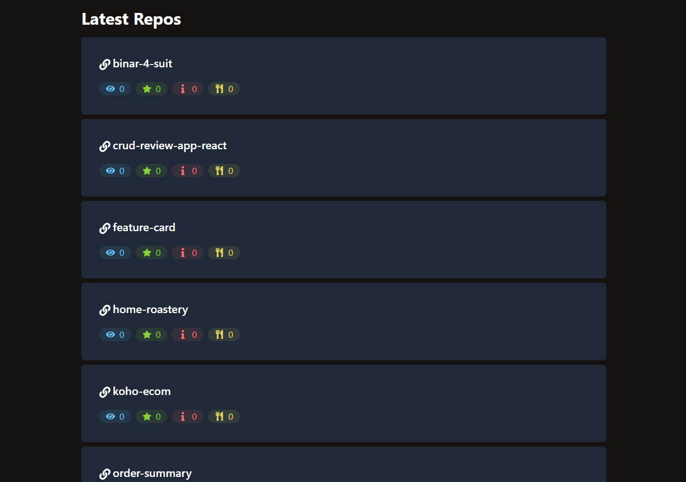

# Overview

An upgrade from my previous project [github-finder](https://github.com/althafdaa/portofolio/tree/main/devfinder-github-api) from Vanulla Javascrupt to React. It's also my first project with Tailwind and Axios.

### How to install

Install the node_modules first

`npm install`

### Features

- Search your github profile up to 30 search queries(maximum github request/minute)
- Form validation
- Clear button
- Profile page
- Latest Repos
- Hireable Indicator/Badge

### Screenshot

## My Process

### Built with

- ReactJs (Component Based, State Management, React Hooks)
- Tailwind CSS
- DaisyUI
- React Router v6
- Axios

### What I Learned

I learned a lot about Tailwind and im having a lot of fun, even though the JSX/html become lot messier with all the utilities classes but the customization is really so easy and it doesnt look like any other web that use high-level framework like Bootstrap.

### Continued Development

Probably Dark/White Theme just like my previous project

## Author

- althafdaa
